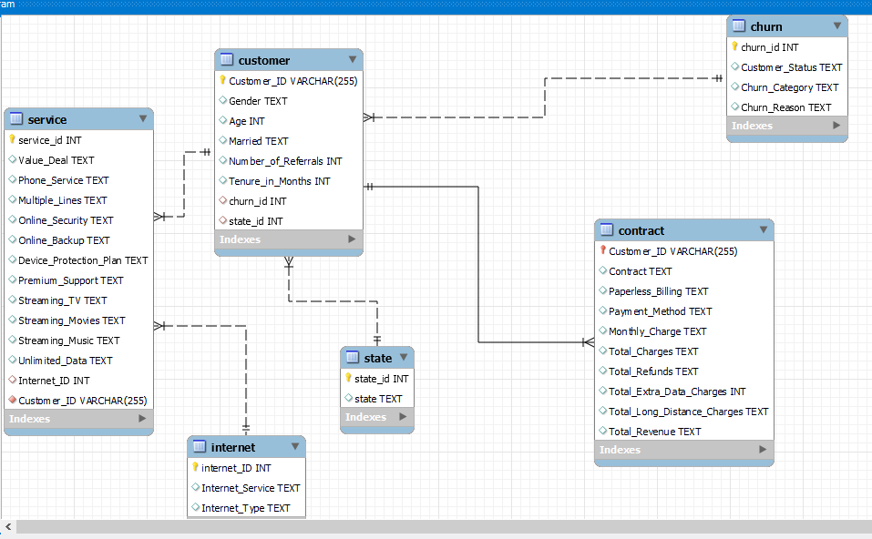
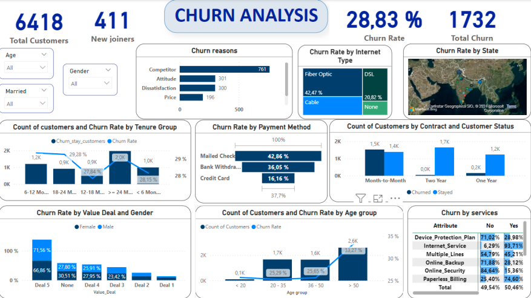
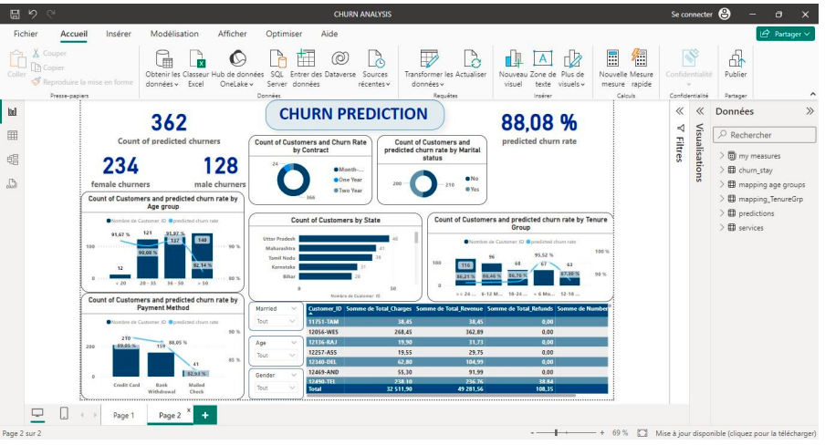

# Customer-Churn-Analysis
## Project Overview
This project focuses on predicting customer churn within a telecommunication company, identifying clients who are most likely to discontinue their service and uncovering the factors influencing their decisions.

By leveraging data analytics and machine learning models, the project aims to provide actionable insights that enable the company to:

* Anticipate customer attrition before it occurs,
* Understand key churn drivers, such as usage patterns, service quality, and customer demographics,
* Implement data-driven retention strategies to improve customer satisfaction and loyalty.

## Objectives

* Identify the key factors influencing customer churn.
* Build predictive models to detect clients at risk of churn.
* Visualize insights through an interactive Power BI dashboard.
* Provide actionable recommendations to improve customer satisfaction.

## Tools & Technologies

* **Languages:** Python, SQL
* **Libraries:** pandas, NumPy, matplotlib, seaborn, scikit-learn
* **Machine Learning Models:** Random Forest, Gradient Boosting and Multilayer Perceptron (Neural Network).
* **Visualization:** Power BI

## Dataset Overview 

## Project Workflow

1. **Data Understanding & Cleaning**
Handled missing values, irrelevant features, and data inconsistencies.

2. **Exploratory Data Analysis (EDA)**
Visualized churn distribution, service types, payment methods, etc.

3. **Feature Engineering**
Encoded categorical variables and derived new meaningful features.

4. **Model Training & Evaluation**
Compared multiple algorithms using metrics such as Accuracy, Precision, Recall, F1-Score, and ROC-AUC.
Selected the best model: Random Forest.

5. **Dashboard Creation**
Designed an interactive Power BI dashboard to visualize churn rates by customer segments, services, and demographics.

## Results

| Model                | Accuracy | Precision | Recall | F1-Score | ROC-AUC |
| :------------------- | :-------: | :-------: | :-----: | :-------: | :-------: |
| Neural Network (MLP) | 0.798 | 0.883 | 0.376 | 0.527 | 0.789 |
| Gradient Boosting    | 0.827 | 0.769 | 0.604 | 0.676 | 0.763 |
| **Random Forest**    | **0.845** | **0.804** | **0.639** | **0.712** | **0.786** |

The Random Forest model achieved the best balance between accuracy and recall, making it the most suitable for churn prediction.

## Dashboards

## Conclusion

The project demonstrates how machine learning and business intelligence can be combined to address customer retention challenges effectively. Through data-driven insights and predictive modeling, organizations can take proactive measures to retain valuable customers and enhance long-term profitability.

## ✨ Happy coding!